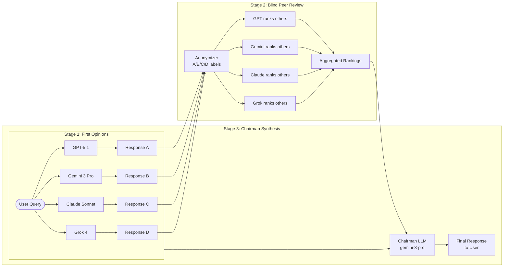
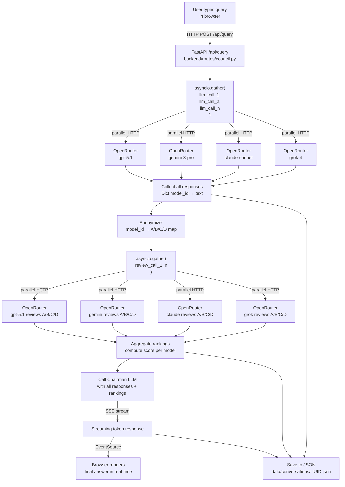
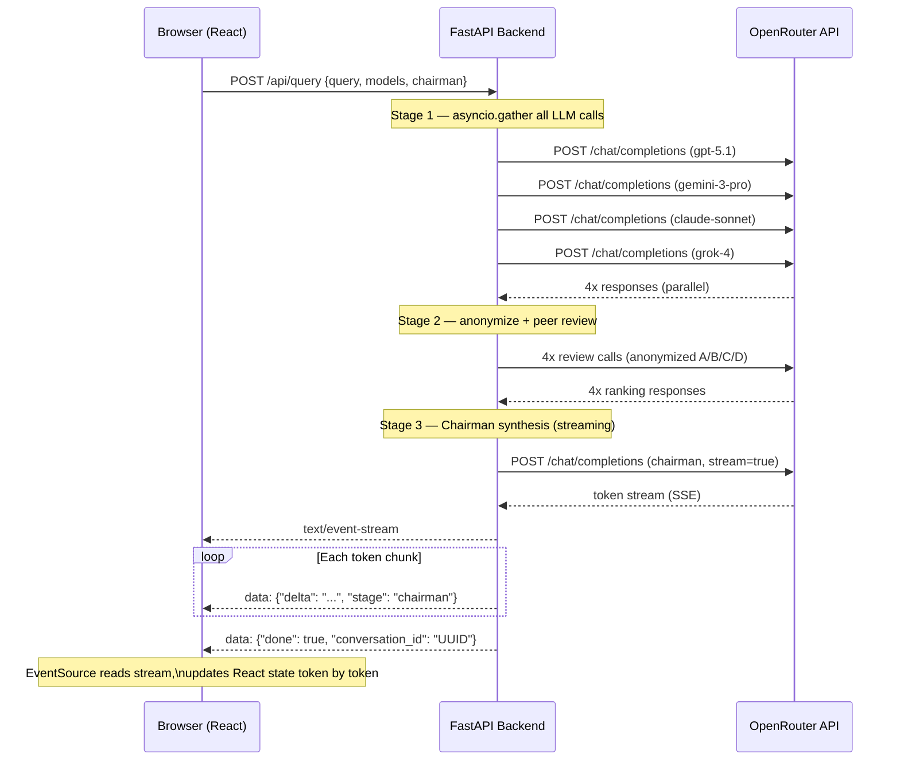
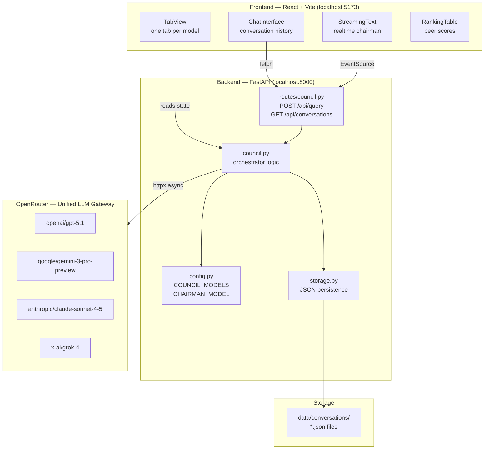

# LLM Council


**LLM Council** is a local web app that replaces single-model queries with a structured 3-stage deliberation process: multiple LLMs answer independently, anonymously critique each other, and a Chairman synthesizes the final response. Built on OpenRouter to access GPT, Gemini, Claude, Grok, and others through a single unified API.

> **Origin:** Forked and extensively reimagined from [karpathy/llm-council](https://github.com/karpathy/llm-council) — a Saturday vibe-code hack by Andrej Karpathy for side-by-side LLM evaluation while reading books with AI. This fork adds extended documentation and Mermaid diagrams for architectural clarity.

---

## How It Works — 3-Stage Council Protocol



**Stage 1 — First Opinions:** All configured LLMs receive the query simultaneously via `asyncio.gather`. Each answers independently without seeing the others' responses.

**Stage 2 — Blind Peer Review:** Each LLM receives all responses with model identities anonymized (`Model A`, `Model B`, etc.) to prevent favoritism. Each ranks by accuracy and insight.

**Stage 3 — Chairman Synthesis:** The designated Chairman LLM receives all original responses plus the peer rankings and compiles a single definitive answer.

---

## Complete Information Flow



---

## SSE Streaming Technical Flow



---

## System Architecture



---

## Quick Start

### 1. Install Dependencies

The project uses [uv](https://docs.astral.sh/uv/) for Python package management.

**Backend:**
```bash
uv sync
```

**Frontend:**
```bash
cd frontend
npm install
cd ..
```

### 2. Configure API Key

Create a `.env` file in the project root:

```bash
OPENROUTER_API_KEY=sk-or-v1-...
```

Get your key at [openrouter.ai](https://openrouter.ai/).

### 3. Configure the Council (Optional)

Edit `backend/config.py`:

```python
COUNCIL_MODELS = [
    "openai/gpt-5.1",
    "google/gemini-3-pro-preview",
    "anthropic/claude-sonnet-4.5",
    "x-ai/grok-4",
]

CHAIRMAN_MODEL = "google/gemini-3-pro-preview"
```

Any model available on [OpenRouter](https://openrouter.ai/models) can be added.

### 4. Run

**One-command start:**
```bash
./start.sh
```

**Manual:**
```bash
# Terminal 1 — Backend
uv run python -m backend.main

# Terminal 2 — Frontend
cd frontend && npm run dev
```

Open **http://localhost:5173** in your browser.

---

## Tech Stack

| Layer | Technology | Purpose |
|-------|-----------|---------|
| Frontend | React + Vite | Chat UI, tab view per model |
| Frontend | `EventSource` API | SSE streaming of Chairman response |
| Frontend | `react-markdown` | Render LLM markdown output |
| Backend | FastAPI (Python 3.10+) | REST + SSE endpoint |
| Backend | `asyncio.gather` | Parallel LLM calls (Stage 1 + 2) |
| Backend | `httpx` async | HTTP client for OpenRouter |
| LLM Gateway | OpenRouter | Unified API for GPT/Gemini/Claude/Grok |
| Storage | JSON files | Conversation history (`data/conversations/*.json`) |
| Packaging | `uv` + `npm` | Python + JS dependency management |

---

## Project Structure

```
llm-council/
├── backend/
│   ├── main.py           # FastAPI app entry point
│   ├── config.py         # COUNCIL_MODELS + CHAIRMAN_MODEL
│   ├── council.py        # 3-stage orchestration logic
│   ├── routes/
│   │   └── council.py    # POST /api/query, GET /api/conversations
│   └── storage.py        # JSON conversation persistence
├── frontend/
│   ├── src/
│   │   ├── App.jsx       # Root + routing
│   │   ├── ChatInterface.jsx  # Main chat view
│   │   ├── TabView.jsx   # Per-model response tabs
│   │   └── StreamingText.jsx  # SSE Chairman streaming
│   ├── package.json
│   └── vite.config.js
├── data/
│   └── conversations/    # UUID.json per conversation
├── pyproject.toml        # uv project config
├── start.sh              # One-command launcher
└── .env                  # OPENROUTER_API_KEY (not committed)
```

---

## API Reference

| Method | Endpoint | Description |
|--------|---------|-------------|
| `POST` | `/api/query` | Submit query → runs full 3-stage council, streams Chairman via SSE |
| `GET` | `/api/conversations` | List saved conversations |
| `GET` | `/api/conversations/{id}` | Retrieve a specific conversation with all stages |

**POST `/api/query` body:**
```json
{
  "query": "What is the halting problem?",
  "models": ["openai/gpt-5.1", "google/gemini-3-pro-preview"],
  "chairman": "google/gemini-3-pro-preview"
}
```

**SSE events emitted during Chairman streaming:**
```
data: {"stage": "stage1_complete", "responses": {...}}
data: {"stage": "stage2_complete", "rankings": {...}}
data: {"delta": "The ", "stage": "chairman"}
data: {"delta": "halting ", "stage": "chairman"}
data: {"done": true, "conversation_id": "uuid-here"}
```

---

## Why This Pattern Is Useful

- **Reduces single-model blind spots:** each LLM has training biases; parallel responses surface disagreements
- **Anonymous peer review eliminates favoritism:** models can't favor themselves when IDs are hidden
- **Chairman synthesis produces higher-quality answers** than any single model alone on complex reasoning tasks
- **Side-by-side tab view** lets you inspect raw model reasoning before the synthesis

---

*Forked from [karpathy/llm-council](https://github.com/karpathy/llm-council) · Extended with Mermaid architecture diagrams*
